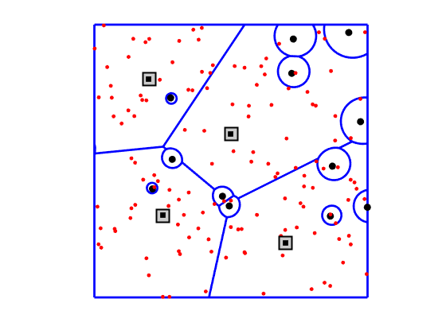
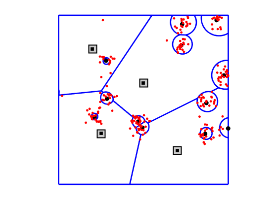
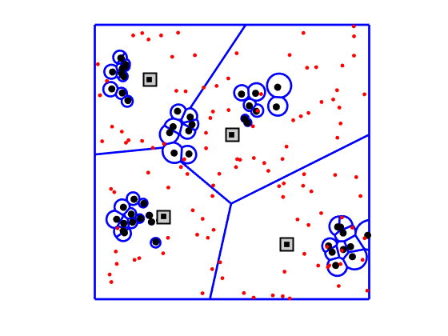
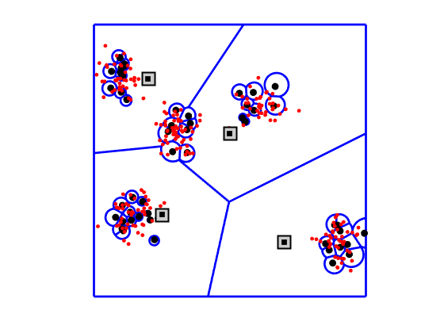

### Illustration of a two-tier HetNet with different spatial configurations of users and base stations 

Run CellMapModel1and2.m and CellMatModel3and4.m to generate the following figures. 

  
  
  
  

